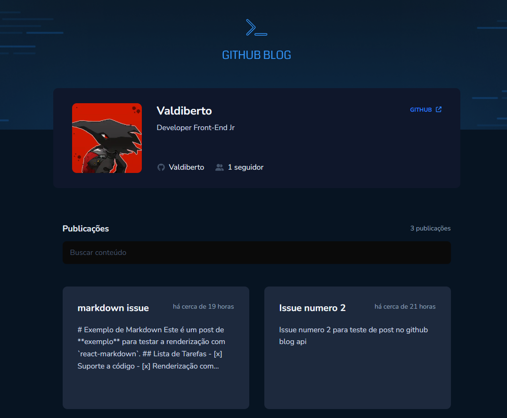

# ✍️ GitHub Blog (Next.js)

Um blog técnico moderno, rápido e responsivo, construído com Next.js 14 (App Router), que utiliza as Issues do GitHub como CMS. Ideal para desenvolvedores que querem escrever e gerenciar conteúdos diretamente do GitHub, com interface agradável e performance otimizada.

## 🌐 Deploy

[Confira a versão em produção](https://github-blognext-myxh.vercel.app/)

## ✨ Funcionalidades

✅ Interface limpa e responsiva com Tailwind CSS

✅ Renderização de Markdown com destaque de sintaxe

✅ Sistema de rotas dinâmicas baseado no número da issue

✅ Visualização de autor, data e comentários

✅ Links externos com ícones e acessibilidade

✅ Geração automática de IDs em headings para navegação

✅ Integração com a API pública do GitHub

✅ Carregamento dinâmico otimizado (SSR/ISR)

## 📸 Capturas de Tela

## 🛠️ Tecnologias Utilizadas

- Next.js 14 (App Router)
- TypeScript
- Tailwind CSS
- React Markdown
- react-syntax-highlighter
- Font Awesome
- Axios
- GitHub Issues API
- slugify
- Radix UI
- shadcn/ui

## 📦 Como Começar

Siga os passos abaixo para rodar o projeto localmente:

1. Clone o repositório:
   `git clone https://github.com/Valdiberto/github-blognext.git`

2. Navegue até a pasta do projeto:
   `cd github-blognext`

3. Instale as dependências:
   `npm install`

4. Configure as variáveis de ambiente:
   Crie um arquivo .env.local com base no .env.example

   `NEXT_PUBLIC_GITHUB_USERNAME=seu-usuario`
   `NEXT_PUBLIC_GITHUB_REPONAME=seu-repositorio`
   `NEXT_PUBLIC_GITHUB_TOKEN=seu_token_pessoal`

   🔐 O token é opcional para repositórios públicos, mas recomendado para evitar rate limit da API.

5. Inicie o servidor de desenvolvimento:

   `npm run dev`

   Abra o navegador e acesse http://localhost:3000

## 📄 Estrutura das Issues

Cada post do blog é uma issue no seu repositório GitHub:

`title`: título do post

`body`: conteúdo em Markdown

`labels`: (opcional) pode usar para categorias

## 🧪 Testes

Este projeto atualmente não inclui testes automatizados. Sinta-se à vontade para contribuir com testes ou melhorias!

## 📤 Deploy

Recomendado com Vercel:

- Conecte seu repositório GitHub
- Configure as variáveis do ambiente
- Deploy automático em push

## 📄 Licença

Este projeto está licenciado sob a Licença MIT.

## 🙋 Autor

Feito com ❤️ por Valdiberto
